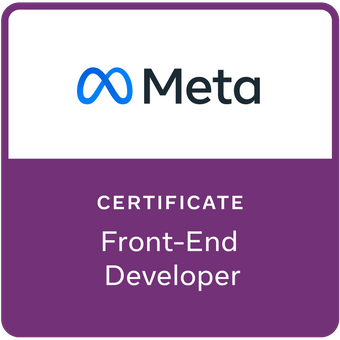

# Meta Front-End Developer Capstone


Building the **landing page** and the **reservations page** of the little lemon restaurant app as part of the [Meta Front-End Developer Certificate](https://www.coursera.org/professional-certificates/meta-front-end-developer) teached by [Meta](https://www.facebook.com/business/learn/front-end-back-end-developer-certificate-coursera).

<p align="center">
    <a href="https://www.credly.com/org/facebook-blueprint/badge/meta-front-end-developer-certificate">
        
    </a>
</p>

### Install dependencies

```bash
npm install
```

### Run the app

```bash
npm run dev
```
